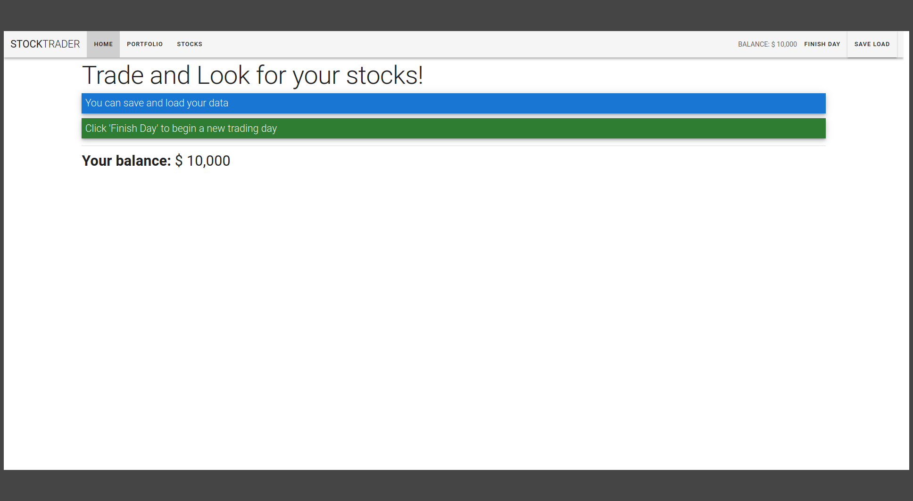
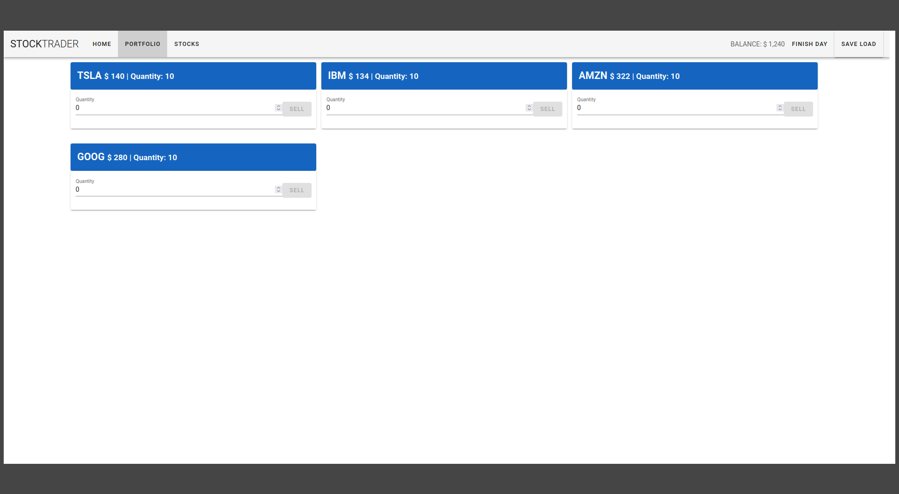
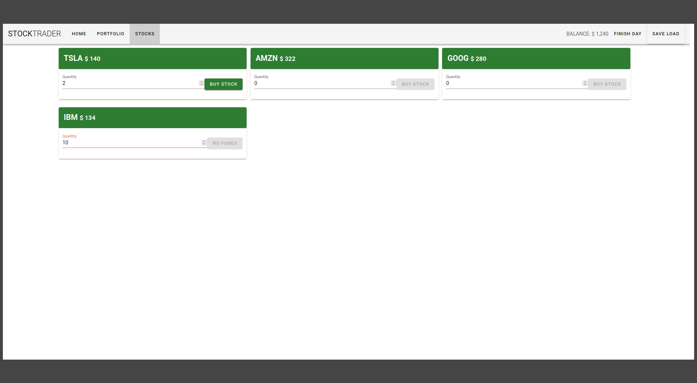

# The Stock Trader

<h2>Introduction</h2>
 
This is a simple VueJS project to play around with stock trading. 
It uses VueJS, Vuetify, Axios and Firebase. 
I made it for learning purposes only, following a <a href="https://www.udemy.com/course/vue-js-completo/"> Udemy tutorial.</a> 
Thanks to Cod3r for the great course. 
 

<h2>Features</h2>

- Buy stocks on the Stocks page
- Sell stocks on the Portfolio page
- Click 'Finish Day' to end the day and change stocks prices
- Save and Load data from Firebase
 

<h2>Screenshots</h2>

<h3>Home</h3>

 
<h3>Portfolio</h3>

 
<h3>Stocks</h3>

 

<h2>Project Setup</h2>
Run <code>npm install</code> to install all dependencies 
And then run <code>npm run serve</code> to compile and hot-reload for development 
